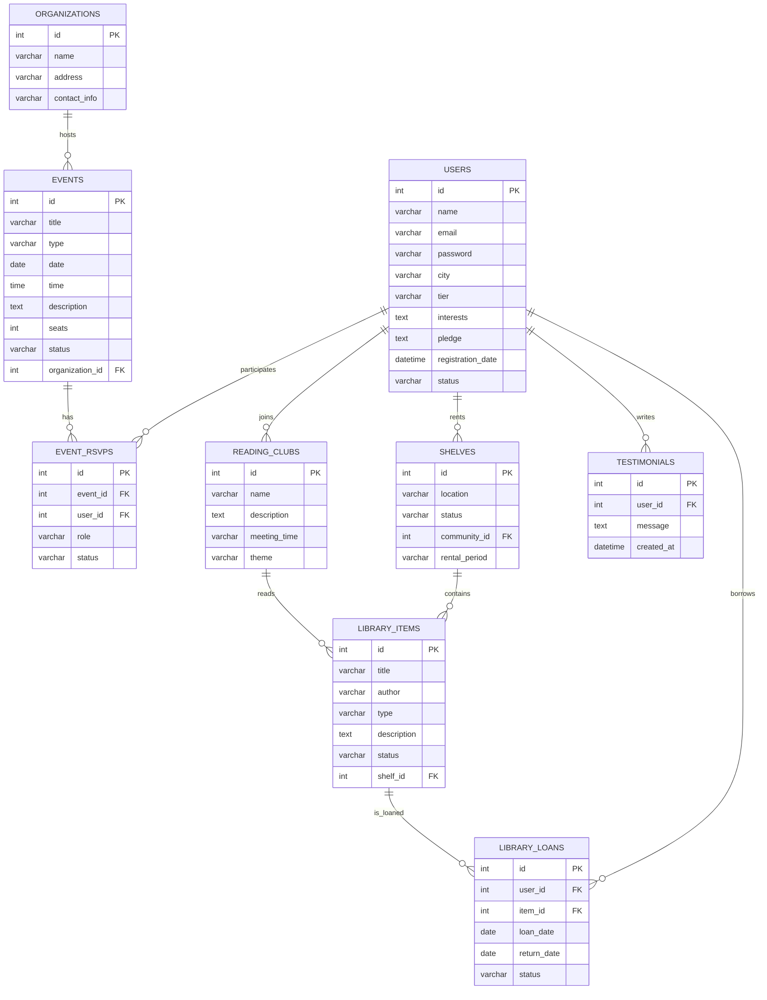
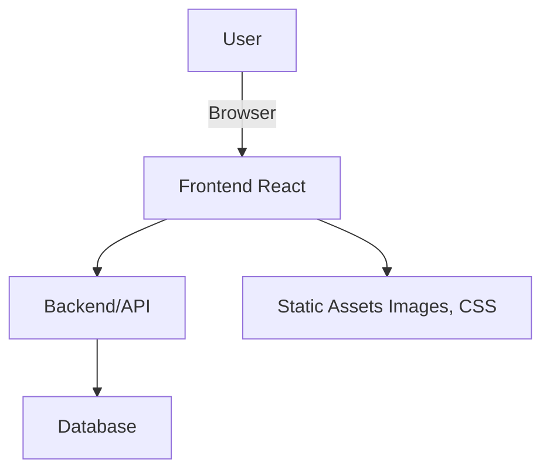
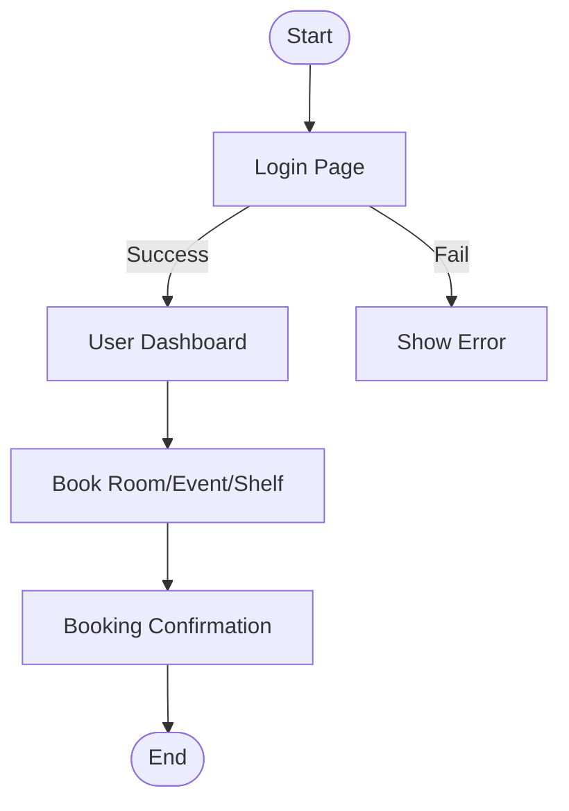
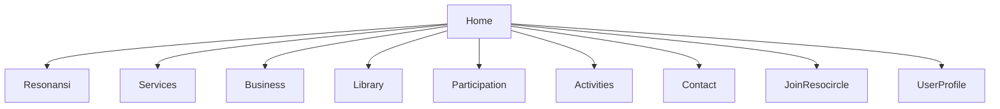

# Completion Report: Resonansi Website

## 1. Introduction
A summary of the Resonansi Website project, its objectives, and key stakeholders.

## 2. Development Process
- **Workflow:** Planning, design, coding, testing, deployment
- **Tools & Frameworks:** React, CSS, etc.
- **Team Roles:** (List roles and responsibilities)
- **Challenges & Solutions:** (Describe any major issues and how they were resolved)

## 3. Achievements
- Completed features and components (e.g., `Home.jsx`, `Nav.jsx`, etc.)
- Key milestones and optimizations
- User feedback and successful user flows/UI improvements

## 4. Maintenance Needs
- Areas requiring regular updates (content, dependencies, security)
- Recommended maintenance schedule and responsible parties
- Documentation and handover materials provided

## 5. Future Recommendations
- Suggested enhancements, new features, or technical improvements
- Advice on scalability, performance, and user engagement

## 6. Supporting Diagrams
### 6.4 MySQL Data Structure (ER Diagram)

### 6.1 System Architecture

### 6.2 User Flow: Login & Booking

### 6.3 UI Sitemap

## 7. Appendices
- Code snippets, screenshots, diagrams, and links to the React source code
- Contact information for further support
